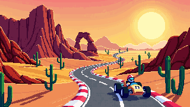

# 🐾 Michi Racer

Juego de carreras arcade **multijugador** para navegador, en **2.5D** y **pixel art**, protagonizado por michis
(gatitos) que corren en karts. Sin cuentas: creas una sala, compartes el link y corren hasta 20 pilotos a la vez.



## Características

- **Render pseudo-3D** estilo arcade clásico (carretera por segmentos, colinas, curvas, parallax) a 60 FPS.
- **Multijugador en tiempo real** con servidor autoritativo (C# + SignalR/MessagePack):
  predicción del lado del cliente, reconciliación, interpolación y largada justa sin importar el ping.
- **Salas por link** (`/room/PX-1234`), lobby con host, LISTO, garaje para elegir color del kart,
  relleno con bots y parrilla de hasta **20 pilotos**.
- **Reconexión**: si se cae la red o recargas la página vuelves a tu kart; también puedes entrar como espectador.
- **Portada animada** con contador de jugadores en línea y totales, **configuración** (brillo, volúmenes) y
  **español / inglés**.
- **Torneo de 4 carreras** con puntos acumulados y **podio animado** (bronce, plata y copa dorada); al final el host
  reinicia o los invitados votan la revancha.
- **Gameplay**: derrape con mini-turbo, pads de velocidad, choques, checkpoints, 3 vueltas, resultados.
- **Power-ups**: turbo, escudo, bomba, rayo, imán, hielo y cohete, más obstáculos (aceite, arena, charcos).
- **Pistas**: *Green Valley* (bosques y montañas nevadas), *Desert Run* (atardecer, dunas y cañón) , *Neon City* (noche, neón y lluvia) y *Coastal Road* (isla tropical con puente: si te sales al mar, ¡salpicón!).
- **Sonido** chiptune generado en vivo (motor, efectos y música por pista).
- **Práctica local** contra bots, teclado o gamepad.
- Arte generado con [PixelLab](https://www.pixellab.ai/).

## Estructura

```
├── documentos/        requerimientos del juego
├── designs/           diseños de pantallas y referencia del personaje
└── software/
    ├── backend/       C# .NET 10 · ASP.NET Core + SignalR (servidor de juego)
    ├── frontend/      TypeScript + Vite · cliente del juego (Canvas)
    └── docker-compose.yml
```

Detalles técnicos (protocolo, herramientas de red, cómo agregar pistas): [software/README.md](software/README.md).

## Levantarlo con Docker (recomendado)

Requisitos: Docker y Docker Compose.

```bash
cd software
docker compose up -d --build
```

Abre `http://<tu-servidor>:8080`. Para usar otro puerto:

```bash
MICHI_PORT=80 docker compose up -d --build
```

- `frontend` (Nginx) sirve el juego y reenvía `/api` y `/hubs` (WebSocket de SignalR) al `backend`.
- Las salas viven en memoria: usa **una sola réplica** del backend.
- Si pones HTTPS con otro proxy delante (Traefik, Caddy, etc.), apúntalo al puerto del frontend y habilita WebSockets.

## Levantarlo en desarrollo

Requisitos: [.NET 10 SDK](https://dotnet.microsoft.com/) y [Node.js 22+](https://nodejs.org/).

```bash
# servidor de juego (http://localhost:5080)
dotnet run --project software/backend/src/MichiRacer.Server --launch-profile http

# cliente (http://localhost:5173), en otra terminal
npm --prefix software/frontend install
npm --prefix software/frontend run dev
```

Para jugar desde otra PC de la red abre `http://<ip-de-tu-pc>:5173`.

## Controles

| Acción | Teclado | Gamepad |
| --- | --- | --- |
| Girar | ← → / A D | Stick izquierdo / cruceta |
| Acelerar | ↑ / W | A / RT |
| Frenar | ↓ / S | B / LT |
| Derrape | Shift | RB / LB |
| Usar ítem | Espacio | X / Y |
| Diagnóstico de red | F3 | |

## Tests

```bash
npm --prefix software/frontend test   # simulación (carrera completa, checkpoints, determinismo)
dotnet test software/backend          # paridad cliente/servidor, salas, reconexión, límites
```
